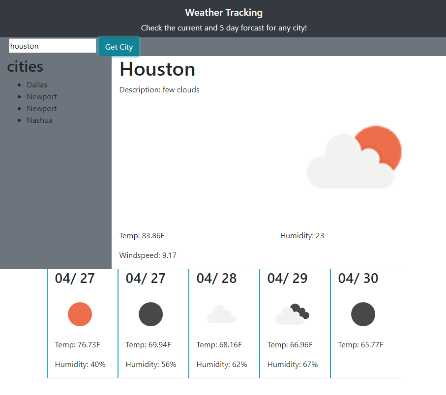

The open weather API allows this site to pull various data from a daily and five day forcast. By typing a city name the information is requested from the API endpoints and displayed to the user. Cities previously searched for are saved to local storage and placed into a drop down list for user reference. 
The built in breakpoints in the bootstrap lobrary let the site automatically adjust its column layout depending on the user's screen size. The API information is called out for each element directly, something that can be shortened with a for loop and a biut more time. 
The real time date information was pulled from the open weather API but configured using moment.js to better fit the page layout. 
Vanilla CSS was used to create borders and an on hover effect for the daily forcast.

